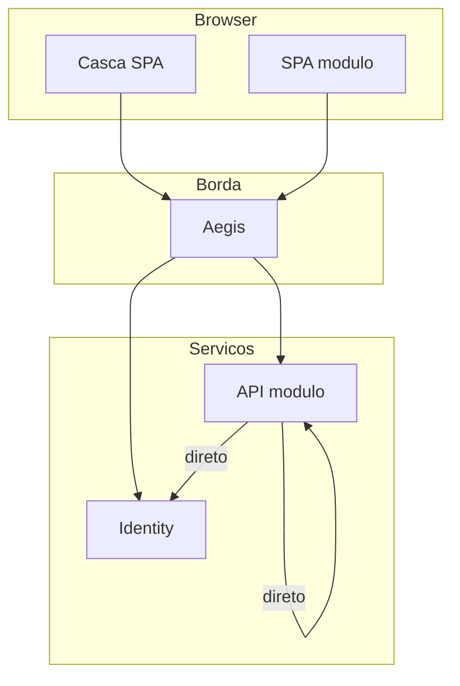

# Limites de escopo

## Pertence ao Aegis

- Origem única de API para o browser.
- Roteamento `/api/{modulo}/**` (e `/public`) por configuração.
- Validação JWT na borda (JWKS).
- CORS, timeout, `503`, RL em público, `X-Request-Id`.
- Sanitização de tentativas de forjar tenant.

## Não pertence ao Aegis

- Login, emissão de JWT, host do JWKS, usuários/perfis → **Identity**
- Menu, UX da casca, navegação entre SPAs → **plataforma**
- Embutir módulo em iframe / `postMessage` → **fora do projeto**
- Regras de domínio e schema → **módulo**
- Tráfego API ↔ API entre módulos → **direto**, sem Aegis

## Mapa

## Resumo

| Pergunta | Resposta |
|----------|----------|
| SPA do módulo → API | Via **Aegis** (`/api/{modulo}`) |
| API → API | **Direto** |
| Iframe? | **Não** |
| Quem emite JWT? | Identity |
| Quem valida na borda? | Aegis |
| Quem valida de novo? | API do módulo |
