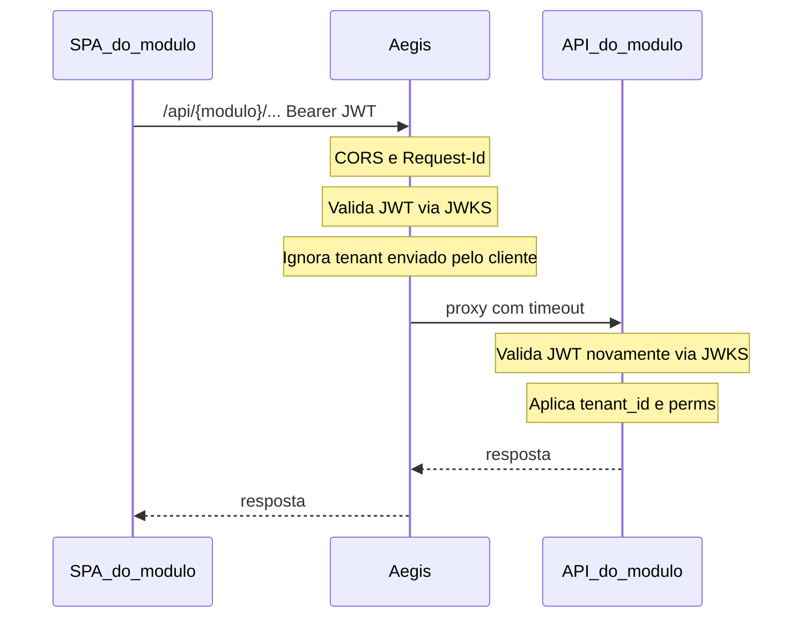
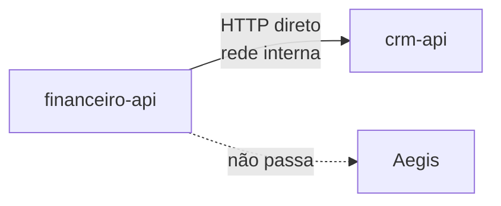

# Contrato do gateway

Comportamento esperado do Aegis: **borda do browser para as APIs**; **sem iframe**; **back↔back direto**.

## Superfície HTTP

| Prefixo | Autenticação | Destino |
|---------|--------------|---------|
| `/api/{modulo}/**` | JWT Bearer (exceto exceções explícitas) | Container do módulo (mapa por env) |
| `/api/identity/**` | Conforme rota (login/JWKS públicos; demais protegidas) | Identity |
| `/public/**` | Sem token | Upstreams públicos |
| `/healthz` | Sem token | Saúde do gateway |

Exemplo de configuração:

```text
AEGIS_MODULES=identity=http://identity:8080,financeiro=http://financeiro-api:9001,crm=http://crm-api:9002
```

Destinos **sempre** por ambiente, nunca hardcoded por módulo no código.

## Fluxo SPA do módulo → API (via gateway)



O SPA **não** chama o host interno do container. Chama a origem pública do gateway.

## Fluxo back-end ↔ back-end (sem gateway)



## Fronts sem iframe

- Cada módulo tem **SPA próprio** (build/container próprios).
- A casca navega para a URL do SPA do módulo (mesmo site via reverse proxy de estáticos, ou path dedicado — decisão de deploy).
- **Sem** iframe e **sem** protocolo `postMessage` `plataforma:sessao`.
- No boot, o SPA do módulo obtém/renova sessão via **Identity** (`/api/identity/...`) na origem do gateway e mantém o access token em memória; depois chama `/api/{modulo}/**` com Bearer.

## Autenticação na borda

| Situação | Comportamento |
|----------|----------------|
| Rota protegida sem token / token inválido | `401` no Aegis |
| Token válido | Encaminha; módulo revalida |
| JWKS | URL do Identity; cache; rotação por `kid` |
| Emissão de token | Só Identity |

Claims típicas: `iss`, `aud`, `sub`, `tenant_id`, identidade, `roles`/`perms`, `iat`, `exp`.

## Isolamento por tenant

- `tenant_id` só do JWT.
- Body/query/header de tenant mandados pelo cliente: ignorar/remover no gateway.
- Exceção: token de serviço (regra do Identity).

## CORS

- Centralizado no Aegis (browser fala com uma origem de API).
- Módulos não precisam configurar CORS para o browser.

## Observabilidade e resiliência

| Aspecto | Expectativa |
|---------|-------------|
| `X-Request-Id` | Gerado/propagado; eco na resposta |
| Timeout | ~3s por proxy ao módulo |
| Upstream down / timeout | `503` com indicação do módulo |
| `/public/**` | Rate limit por IP → `429` |

## Responsabilidades

### Casca

- UX de login (contra Identity via gateway).
- Menu e navegação para os SPAs dos módulos (sem iframe).

### Identity

- Tokens, JWKS, `/me`, usuários, tenant, perms.

### SPA do módulo

- Boot: sessão via Identity na origem do gateway.
- APIs do domínio: `/api/{seu-codigo}/**` via gateway com Bearer.

### API do módulo

- Validar JWT (JWKS); RBAC; filtro por `tenant_id`.
- Chamar outros módulos **direto** na rede interna.
