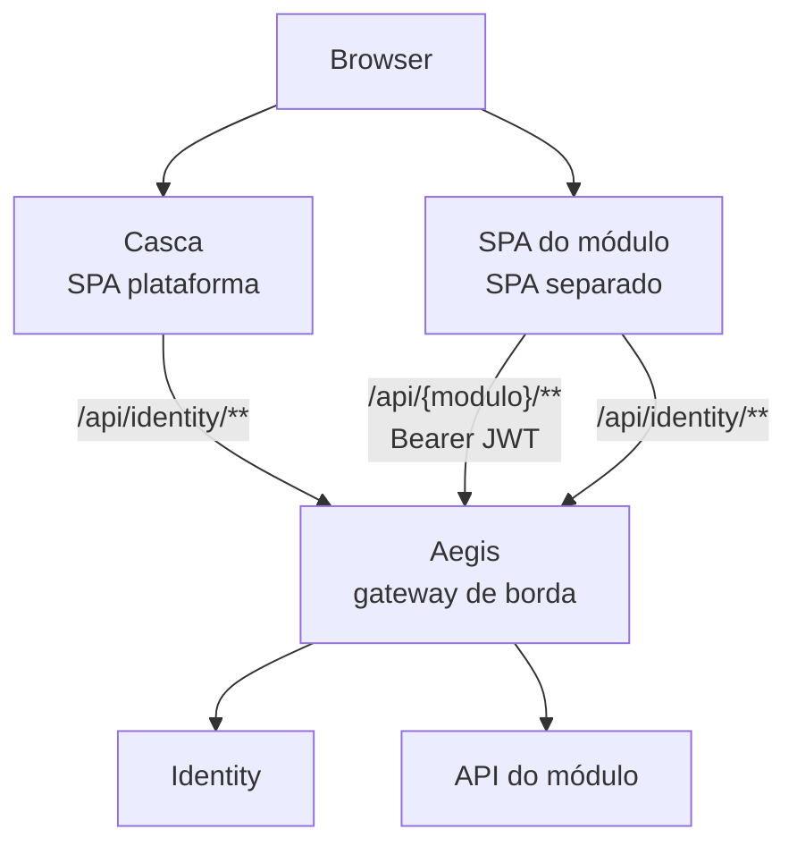

# Visão geral e posicionamento

## Contexto

Vários times entregam **módulos** (cada um com SPA + API). A **casca (plataforma)** é a entidade mãe (entrada, menu, navegação). O **Identity** é o módulo de autenticação. O **Aegis** é o **API gateway de borda**: o navegador fala com uma origem; as APIs dos módulos são alcançadas via `/api/{modulo}/**`.

Fronts são **SPAs separados**. **Não** usamos iframe nem `postMessage` para embutir módulo.

## Papéis

| Componente | Responsabilidade |
|------------|------------------|
| **Casca** | Login UX, menu, links para os SPAs dos módulos |
| **Identity** | Login, JWT, JWKS, `/me`, usuários, tenant, perms |
| **Aegis** | Única origem de API no browser; roteia, valida JWT na borda, CORS, limites |
| **SPA do módulo** | UI do domínio; chama `/api/{seu-modulo}/**` e Identity **via gateway** |
| **API do módulo** | Domínio; valida JWT de novo (JWKS); chama outros módulos **direto** |

## Princípios

1. **Uma origem de API no browser.** Chamadas de SPA (casca ou módulo) a backends passam pelo Aegis em `/api/...`.
2. **Auth só no Identity.** Nenhum módulo emite token nem tem tela de senha.
3. **Duas camadas:** Aegis valida JWT na entrada; a API do módulo valida de novo (JWKS).
4. **Back ↔ back sem Aegis.** Containers se chamam pelo nome na rede interna.
5. **Tenant vem do JWT.** Cliente não impõe `tenantId` por body/query/header.
6. **SPA separado, sem iframe.** Sessão no boot do módulo via Identity (ex. `/me` / refresh) na mesma origem do gateway — não `postMessage`.

## O que o Aegis é

Reverse proxy de borda: `/api/{modulo}/**` → container (URL por env), JWT/JWKS, CORS, `/public`, timeout/`503`, rate limit público, `X-Request-Id`.

## O que o Aegis não é

- Não é Identity (não emite token).
- Não é a casca (menu/UX).
- Não é barramento obrigatório entre APIs de módulos.
- Não embute front de módulo (sem iframe).
