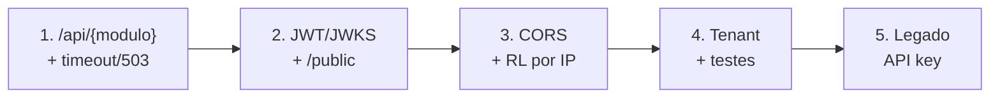

# Lacunas e roadmap (Aegis como gateway de borda)

Gap analysis entre a `main` e o [contrato](../architecture/gateway-contract.md).

**Premissas:** SPA → API via gateway; back↔back direto; **sem iframe**.

## Prioridade essencial

| # | Lacuna | Direção | Áreas |
|---|--------|---------|--------|
| 1 | Roteamento `/api/{modulo}/**` por env | Mapa `modulo=url`; match por prefixo | `config`, `routing`, `router`, `proxy` |
| 2 | Validação JWT via JWKS | Middleware Bearer; cache de chaves | pacote JWT |
| 3 | `/public/**` e `/healthz` sem auth | Bypass por path | middleware + router |
| 4 | CORS centralizado | Middleware + env | `cors`, config |
| 5 | Timeout ~3s + `503` | Transport + ErrorHandler | `proxy` |
| 6 | Rate limit por IP em `/public/**` | RL por IP | ratelimit |
| 7 | Tenant só do JWT | Strip/ignore tenant do cliente | JWT + proxy |
| 8 | Boot sem Postgres/Redis obrigatórios no caminho JWT | DB/Redis opcionais ou só legado API key | `main`, config |

## Prioridade desejável

| # | Item |
|---|------|
| 9 | Headers internos opcionais após validar JWT (`X-User-Id`, `X-Tenant-Id`) |
| 10 | Envelope de erro padronizado |
| 11 | Métricas / tracing |
| 12 | Testes: rota, JWT, timeout→503, CORS, public RL |
| 13 | README operacional alinhado a `docs/` |

## Fora do escopo do Aegis

- Identity (login/emissão de token).
- Casca / menu / navegação entre SPAs.
- Iframe e `postMessage`.
- Forçar back↔back a passar pelo gateway.
- API key + quota como auth do browser (legado).

## Ordem sugerida

## Critérios de aceite

- SPA chama `/api/{modulo}/...` com JWT válido e a request chega ao container certo.
- Sem JWT em rota protegida → `401` no Aegis.
- API do módulo continua responsável por revalidar JWT.
- `/public/**` sem Bearer; abuso por IP → `429`.
- Upstream down/lento → `503`.
- Docs afirmam: browser via gateway; back↔back direto; sem iframe.
